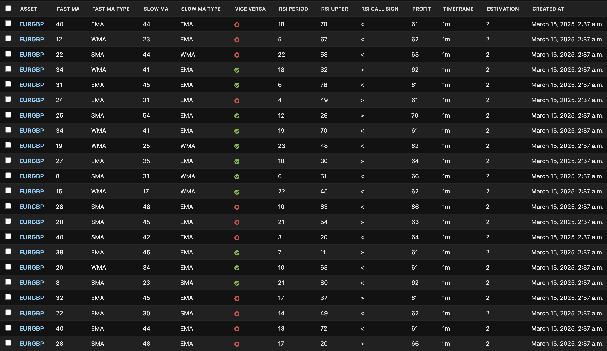

# Pocket Option Trading Bot
## [Pocket Option](https://pocket2.click/register?utm_campaign=806509&utm_source=affiliate&utm_medium=sr&a=ovlztqbPkiBiOt&ac=github) robot

[Download Bot v2 for Windows](https://drive.google.com/file/d/1NnOpoKeE08Q-oMSzpQ-VZ2h4i7ZtHAVB) password: Password

[Download Bot v1 for Windows](https://drive.google.com/file/d/1RiNGyNvrSooTqOWVv6vj9GKtWupOtfMs) password: Password

I always recommend trying a product before buying. The trial version of the product allowed us to do this. After the trial version, I recommend trying the product in demo mode.

### What's new in v2
- allowed multiple assets
- all timeframes allowed
- added visual interface to setup your trading strategy
- it works faster now (async), no screen reloading required
- it's possible to set minimal payout
- you may set take profit and stop loss
- you may invert Call and Put with Vice Versa feature
- improved Martingale, you can set a list of amounts yourself
- backtest! You may backtest your strategy and see the approximate profit and frequency on historical data
- EXPERIMENTAL. Server strategies added. They generated on a server every day based on data from the previous 7 days. See example below.

### Run other bots
`python3 po_bot_indicators.py`
to run trading bot with strategy based indicators (only Mac and Linux users)

`python3 po_bot_ml.py`
to run trading bot with Machine Learning for prediction (only Mac and Linux users)

### Other scripts
`python3 test_on_historical_data.py`
to test your strategies on historical data (only Mac and Linux users)

### Information
Bot connects to websocket and receives signals every half a second from PO.
To make it more convenient, I simplify data to 1 second so that to use seconds
everywhere. After each change of currency, the screen reloads. It is to cut
unwanted signals from previous currencies.

### Pocket Option trading bot Martingale
`po_bot.py` - Martingale trading. The default strategy is pretty simple. If the previous candles are red, the bot makes 'put' order. And 'call' otherwise. You can see a current Martingale stack in the console (Martingale stack). For example, Martingale stack [1, 3, 7, 15, 31, 62, 124, 249, 499, 999] means that if you order $1 and lose, the next order will be $3, then $7, and so on. You can change `MARTINGALE_COEFFICIENT`.
!Important. Your timeframe always must be >= estimation. For example, if your timeframe is 10s, your estimation can't be 11s and higher.

### Pocket Option trading bot v2
`po_bot_v2.py` - the last version of the trading bot with all features.

### Pocket Option trading bot with indicators
`po_bot_indicators.py` - script allows you to try different indicators and their combinations. See how an example in `check_indicators()` works and make your updates. Currently, the PSAR strategy is used. Despite using default parameters `acceleration_step=0.02`, `max_acceleration_factor=0.2`, bot's sensitivity is higher, so additional orders appear. Works for 1m and higher timeframes. 
Only for Mac, Linux, .NET6.0 or newer required: https://dotnet.microsoft.com/en-us/download/dotnet/6.0

### Pocket Option trading bot with machine learning
`po_bot_ml.py` - script makes orders based on prediction. Random Forest Classifier approach is used. The prediction is based on the indicators: `awesome_oscillator`, `PSAR`, `CCI` and `MACD` from the last 100 candles. Bot makes an order when the probability is > 0.60. You can set even higher values (0.70, 0.80, 0.90) in the `check_data()` method. !important! You have to set estimation = TIME param. For example, if your `po_bot_ml.py/TIME`=5, then set your estimation to 5 candles. Another example, your timeframe is 30m, and your estimation is 1h, so set TIME=2. The bot makes a prediction only for PUT action. And if probability < 30%, then CALL action fires. Works for 1m and higher timeframes. 
Only for Mac, Linux, .NET6.0 or newer required: https://dotnet.microsoft.com/en-us/download/dotnet/6.0

### Backtest
`test_on_historical_data.py` - here you can backtest strategies on historical data of 1m and 5m timeframes. To create your own history files, set `SAVE_CSV` to `True` in `po_bot_indicators.py`. Or you can use any non-OTC assets available in yfinance to get history data.
Also, backtest is a feature in v2.

### FAQ
`Is it free?`
Version 1 is fully free, and you can use it without any payments. Version 2 is paid with 10 free trades every day as a trial.

`Is it profitable?`
Sometimes you will have profitable days. But you should always remember that 95% of traders lose in trading. And you are most likely one of them. No bot and no signals work in the long run.

`What's the purpose of the Bot then?`
The goal of the bot is to strengthen your Python programming skills, motivating you with the illusory opportunity to get rich.

### Links
[Pocket Option registration link](https://pocket2.click/register?utm_campaign=806509&utm_source=affiliate&utm_medium=sr&a=ovlztqbPkiBiOt&ac=github)

[Telegram](https://t.me/pocketoption_trading_bot)

[YouTube](https://www.youtube.com/channel/UCfVo7aRwQ0M0EV6LeC7R5Gw)

### Donations
If you want to thank the author for his work, [buy me a coffee](https://buymeacoffee.com/vitaliisviatiuk).

### Keywords
- торговый бот для pocket option
- бот для pocket option
- бот для торговли на pocket option
- телеграм бот сигналы для трейдинга pocket option
- купить бот для заработка pocket option
- бот для pocket option бесплатно
- pocket option robot
- pocket option robot скачать
- pocket option robot стратегии
- pocket option robot скачать бесплатно
- pocket option robot лучшая стратегия